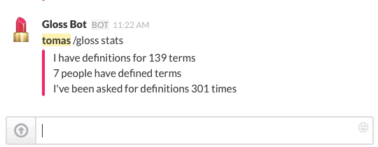

# Glossary Bot
This is a simple web app designed to be used as a [Slack integration](https://slack.com/integrations). Specifically, it responds to POSTs created by the Slack *Slash Commands* integration and responds with messages to Slack's *Incoming Webhooks* integration.

Glossary Bot maintains a glossary of terms created by its users, responds to requests with definitions.



#### Install
Glossary Bot is a [Flask](http://flask.pocoo.org/) app built to run on [Heroku](https://heroku.com/).

To install locally, clone this repository and cd into the resulting directory:

```
git clone git@github.com:codeforamerica/glossary-bot.git
cd glossary-bot
```

Set up and activate a new virtual environment using [Virtualenv](https://github.com/codeforamerica/howto/blob/master/Python-Virtualenv.md):

```
virtualenv venv-glossary-bot
```

Activate the virtual environment:

```
source venv-glossary-bot/bin/activate
```

Install the required packages with pip:

```
pip install -r requirements.txt
```

Create the production [PostgreSQL](https://github.com/codeforamerica/howto/blob/master/PostgreSQL.md) database:

```
createdb glossary-bot
```

Copy `env.sample` to `.env` and make sure that the value of `DATABASE_URL` matches the name of the database you created in the last step:

```
cp env.sample .env
```

Initialize the database:

```
python manage.py createdb
```

And run the application:

```
python manage.py runserver
```

#### Test
To run the app's tests, first create a test database. Make sure the name of the database matches the value of `environ['DATABASE_URL']` set in the `setUp()` function in [test/test_bot.py](https://github.com/codeforamerica/glossary-bot/blob/master/tests/test_bot.py):

```
createdb glossary-bot-test
```

You can now run the tests from the command line:

```
python manage.py runtests
```

or run an individual test:

```
python tests/test_bot.py BotTestCase.test_get_definition
```

#### Set Up on Slack

Glossary Bot uses two Slack integrations: [Slash Commands](https://api.slack.com/slash-commands) for private communication between the bot and the user, and [Incoming Webhooks](https://api.slack.com/incoming-webhooks) for posting public messages.

[Set up a Slash Command integration](https://my.slack.com/services/new/slash-commands). There are three critical values that you need to set or save: **Command** is the command people on slack will use to communicate with the bot. We use `/gloss`. **URL** is the public URL where the bot will live; you can fill this in after you've deployed the application to Heroku, as described below. **Token** is used to authenticate communication between Slack and the bot; save this value for when you're setting up the bot on Heroku.

[Set up an Incoming Webhooks integration](https://my.slack.com/services/new/incoming-webhook). The two important values here are: **Post to Channel**, which is a default channel where public messages from the bot will appear. This default is always overridden by the bot, but you do need to have one – we created a new channel called *#testing-glossary-bot* for this purpose. Save the value of **Webhook URL**; this is the URL that the bot will POST public messages to and you'll need it when setting up Gloss Bot on Heroku.

#### Deploy on Heroku

Now it's time to deploy the bot to Heroku! First, make sure you've got the basics set up by following [Heroku's instructions for getting started with Python](https://devcenter.heroku.com/articles/getting-started-with-python-o).

Now, create a new Heroku application with a unique name ([Heroku docs](https://devcenter.heroku.com/articles/getting-started-with-python-o#deploy-your-application-to-heroku)):

```
heroku create my-glossary-bot
```

When you deploy your app, it'll be reachable at a URL like *https://my-glossary-bot.herokuapp.com/*. Enter this URL into the **URL** field of the Slash Commands integration on Slack.

To give the bot everything it needs to communicate with Slack, set the config variables you saved when you set up the Slack integrations above. The **Token** from the Slash Command integration:

```
heroku config:set SLACK_TOKEN=1234567890
```

and the **Webhook URL** from the Incoming Webhooks integration:

```
heroku config:set SLACK_WEBHOOK_URL=https://hooks.slack.com/services/1234567/1234567/1234567890
```

Run a simple git push to deploy the application:

```
git push heroku master
```

And you're good to get glossing!
